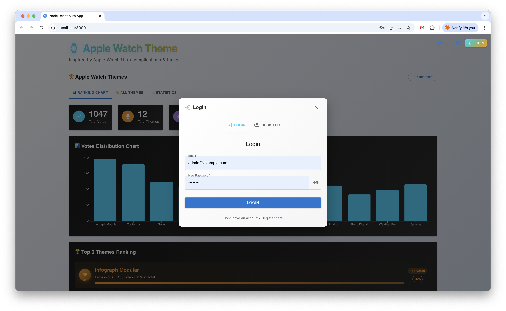
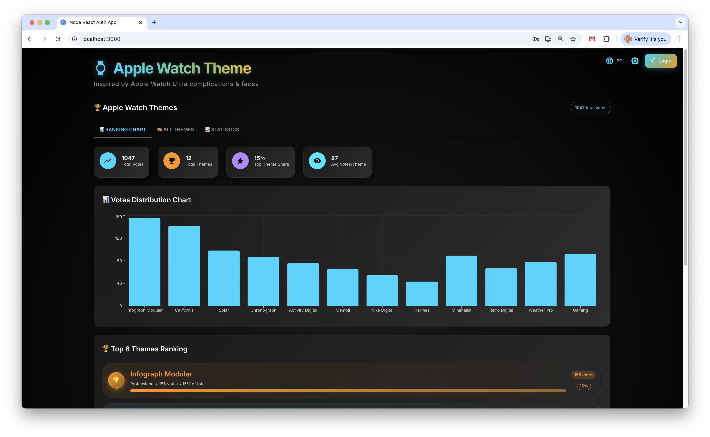
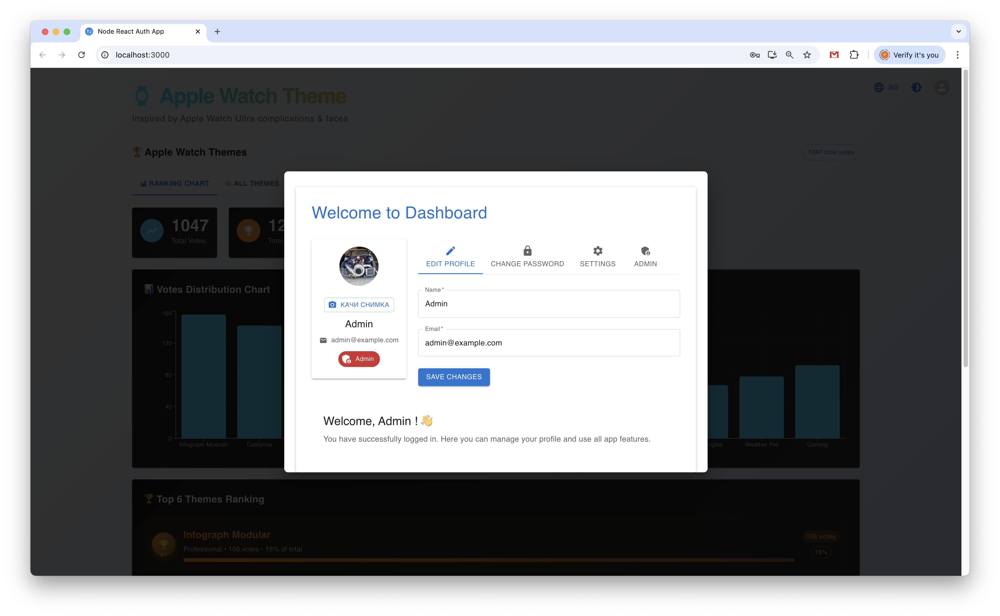

# Node.js TypeScript RESTful API + React Client

This project includes a RESTful API built with Node.js and TypeScript, and a modern React client with Material-UI, global language switching (BG/EN), light/dark theme, dashboard with profile picture upload, admin dashboard, and user interface for registration and login. **Now featuring Apple Watch themes from WCH App and Facer.io!**

## Project Structure (Updated)

- **server/ (Backend - Node.js + TypeScript):**
  - src/
    - app.ts: Express app setup
    - server.ts: Entry point (starts the server, auto-creates admin)
    - controllers/: Route handlers
    - routes/: Route definitions (admin endpoints included)
    - services/: Business logic (admin user creation)
    - models/: Database models/schemas
    - middleware/: Express middleware (auth, upload, etc.)
    - utils/: Utility/helper functions (image processing, cleanup)
    - types/: TypeScript type definitions
    - config/: Configuration files
  - uploads/avatars/: Uploaded profile pictures
  - dist/: Compiled JavaScript files
- **client/ (Frontend - React + Material-UI):**
  - src/
    - components/: UI components (Login, Register, Dashboard, Admin, TechDashboard, etc.)
    - LanguageContext.js: Global language context (BG/EN)
    - App.js: Main app logic with theme context
    - theme/: Custom themes (techTheme, watchTheme, bevelTheme)
  - public/: Static assets

## 🍎 Apple Watch Themes Integration

### Featured Watch Faces
The application now includes a comprehensive collection of Apple Watch themes from the most popular customization platforms:

#### **From [WCH App](https://wchapp.com/):**
- **Infograph Modular** - Data-rich modular face with customizable complications
- **California** - Classic analog design with modern complications  
- **Solar** - Dynamic solar animation with time-based complications
- **Chronograph** - Precision chronograph with stopwatch functionality
- **Activity Digital** - Fitness-focused with activity rings and metrics
- **Memoji** - Personalized with animated Memoji characters
- **Nike Digital** - Nike-inspired with bold typography and colors
- **Hermès** - Luxury leather-inspired with elegant complications

#### **From [Facer.io](https://www.facer.io/):**
- **Minimalist** - Clean, minimal design with essential information
- **Retro Digital** - Vintage digital watch aesthetic with modern features
- **Weather Pro** - Weather-focused with detailed forecasts and conditions
- **Gaming** - Gaming-inspired with pixel art and neon effects

### TechDashboard Features
- **Interactive voting system** - Users can vote for their favorite watch faces
- **Real-time rankings** - Dynamic ranking based on user votes
- **Source badges** - Visual indicators showing the origin platform (WCH App/Facer.io)
- **Category filtering** - Filter themes by category (Professional, Classic, Sports, etc.)
- **Responsive design** - Optimized for all screen sizes
- **Theme previews** - Custom icons for each watch face type

## Setup Instructions

### Backend (API)

1. **Install dependencies:**
   ```bash
   npm install
   ```
2. **Compile TypeScript:**
   ```bash
   npm run build
   ```
3. **Start MongoDB:**
   - Locally or with Docker Compose:
     ```bash
     docker-compose up -d
     ```
4. **Run the API:**
   ```bash
   npm run dev
   # or
   npm start
   ```
   - By default, the API runs on port **5002**.
   - **Admin user is auto-created on server start:**
     - **Email:** `admin@example.com`
     - **Password:** `admin123`
     - **Change this password in production!**

### Frontend (React Client)

1. **Install dependencies:**
   ```bash
   cd client
   npm install
   ```
2. **Start the client:**
   ```bash
   npm start
   ```
   - By default, the client runs on port **3000** (or next available).

3. **Open in browser:**
   - [http://localhost:3000](http://localhost:3000)

## Main UI Features

- **Global language switching (BG/EN):**
  - Button in the top right to switch the language of the entire interface
- **Light/Dark theme:**
  - Global toggle next to the language button
  - Automatic saving of preferred theme
  - Adaptive colors for all components
- **Login/Register:**
  - Compact forms with Material-UI
  - Show/hide password functionality
  - One-click navigation between login and registration
- **TechDashboard (Main Interface):**
  - **Apple Watch themes showcase** with voting system
  - **Real-time rankings** and category filtering
  - **Interactive theme cards** with source badges
  - **Responsive grid layout** for optimal viewing
  - **Theme previews** with custom icons
- **Dashboard:**
  - Profile information, status, role
  - **Profile picture upload (avatar):**
    - Upload button under the avatar
    - Automatic resize and crop to 200x200px
    - Supports JPEG, PNG, GIF and other formats
    - Web optimization (85% JPEG quality)
  - Tabs: Edit Profile, Change Password, Settings
  - Responsive design
  - Logout
- **Admin Dashboard (only for admin users):**
  - **Admin tab** visible only for users with `role: admin`
  - **Avatar Storage Statistics:**
    - Total files and total size
    - Refresh stats button
    - Cleanup unused files button (deletes orphaned avatars)
    - All texts are multilingual (BG/EN)

## API Usage (Updated)

- **Registration:** `POST /auth/register`
- **Login:** `POST /auth/login`
- **User operations:** `/users`, `/users/:id` (JWT protected)
- **Avatar upload:** `POST /users/me/avatar` (multipart/form-data)
- **Admin endpoints:**
  - **Avatar stats:** `GET /admin/avatars/stats` (admin only)
  - **Avatar cleanup:** `GET /admin/avatars/cleanup` (admin only)
- **Swagger documentation:** [http://localhost:5002/api-docs](http://localhost:5002/api-docs)

## JWT Authentication

- Upon successful login, a JWT token is received, stored in localStorage, and used to access protected resources.
- The token contains userId and role.

## File Upload & Image Processing

- **Uploaded files are stored in:** `server/uploads/avatars/`
- **Automatic processing:**
  - Resize to 200x200px
  - Crop to square (preserves center)
  - Convert to JPEG format
  - Web optimization
- **Maximum size:** 5MB (before processing)
- **Supported formats:** All image formats
- **Old avatars are deleted automatically when a new one is uploaded.**
- **Unused avatars can be cleaned up via the admin dashboard or API.**

## Docker Compose

- You can start MongoDB with:
  ```bash
  docker-compose up -d
  ```
- Data is stored in Docker volume.

## Example Requests

```bash
# Registration
curl -X POST http://localhost:5002/auth/register -H 'Content-Type: application/json' -d '{"name":"Test","email":"test@example.com","password":"testpass"}'

# Login
curl -X POST http://localhost:5002/auth/login -H 'Content-Type: application/json' -d '{"email":"test@example.com","password":"testpass"}'
# Response: { "token": "...", "user": {...} }

# Avatar upload
curl -X POST http://localhost:5002/users/me/avatar \
  -H 'Authorization: Bearer YOUR_TOKEN' \
  -F 'avatar=@/path/to/image.jpg'
# Response: { "avatarUrl": "/uploads/avatars/123456.jpg" }

# Admin: Get avatar stats
curl -X GET http://localhost:5002/admin/avatars/stats \
  -H 'Authorization: Bearer ADMIN_TOKEN'

# Admin: Cleanup unused avatars
curl -X GET http://localhost:5002/admin/avatars/cleanup \
  -H 'Authorization: Bearer ADMIN_TOKEN'
```

## Technical Details

### Backend Dependencies
- **Express.js** - Web framework
- **Mongoose** - MongoDB ODM
- **JWT** - Authentication
- **Multer** - File upload handling
- **Sharp** - Image processing
- **CORS** - Cross-origin requests
- **Swagger** - API documentation

### Frontend Dependencies
- **React** - UI library
- **Material-UI (MUI)** - Component library
- **Context API** - State management (language, theme)
- **Fetch API** - HTTP requests
- **Framer Motion** - Animations
- **Recharts** - Data visualization

## 🎨 Theme Sources

This application showcases watch faces from the most popular Apple Watch customization platforms:

- **[WCH App](https://wchapp.com/)** - Ultimate Apple Watch customization platform
- **[Facer.io](https://www.facer.io/)** - Leading smartwatch customization platform

## Screenshots

> **Add your screenshots to the `client/public/screenshots/` folder and rename them if needed.**

### Login/Register 


### Dashboard 


### Settings 



[//]: # ()
[//]: # (### Dashboard &#40;EN&#41;)

[//]: # (![Dashboard EN]&#40;client/public/screenshots/dashboard-en.png&#41;)

[//]: # ()
[//]: # (### Dark Mode)

[//]: # (![Dark Mode]&#40;client/public/screenshots/dark-mode.png&#41;)

[//]: # ()
[//]: # (### Avatar Upload)

[//]: # (![Avatar Upload]&#40;client/public/screenshots/avatar-upload.png&#41;)

[//]: # ()
[//]: # (### Admin Dashboard)

[//]: # (![Admin Dashboard]&#40;client/public/screenshots/admin-dashboard.png&#41;)

[//]: # ()
[//]: # (---)

[//]: # ()
[//]: # (_To add your images, take a screenshot, save it in `client/public/screenshots/` and edit the names above if needed._)

## Security Note

**Change the default admin password in production!**

## License

This project is licensed under the MIT License.